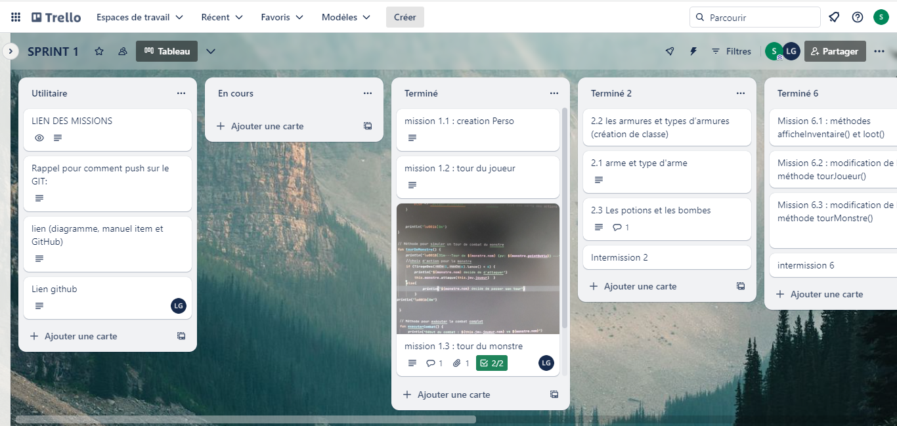
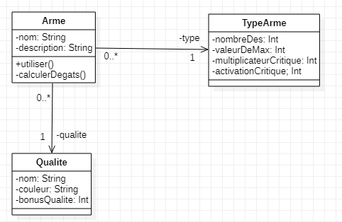
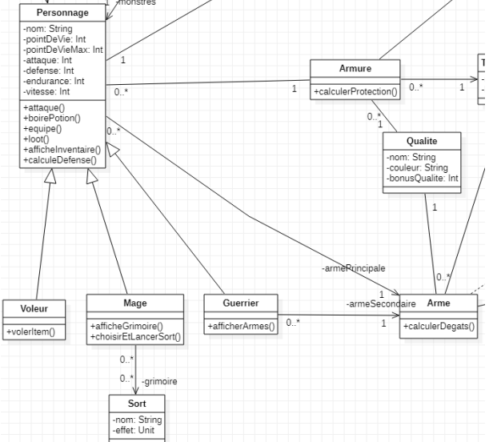

 
= Jeu De Rôle
:toc:
:toclevels: 4

== Projet 
projet réalisé par Belkacem Nassim, Gérance Lény et Ben Boubaker Sheinez

=== présentation

Le jeu de rôle appelé KotlinAventure est un jeu d'aventure  qui plonge les joueurs dans un monde fantastique rempli de monstres redoutables, de personnages héroïques et de combats épiques !

Le jeu se déroule dans un univers médiéval-fantastique où les joueurs incarnent un personnage.

Voici un aperçu des classes de personnages disponibles :

Guerrier : Les guerriers sont des combattants puissants armés. Ils sont connus pour
leur force brute et leur capacité à infliger des dégâts élevés en combat.

Voleur : Les voleurs excellent dans l'art de la discrétion et de la ruse. Ils sont
capables de voler des objets précieux à leurs ennemis et de se faufiler dans les
ombres pour échapper aux dangers.

Mage : Les mages maîtrisent l'art de la magie et peuvent lancer des sorts
dévastateurs. Ils ont un grimoire rempli de sorts variés, chacun ayant un effet unique
sur les adversaires.

=== objectif 
Son objectif principal du jeu est de vaincre des monstres redoutables pour gagner des récompenses et améliorer l’équipement de votre personnage. Pour cela nous avons différentes missions à faire pour améliorer la base du jeu et la personnaliser. 

=== fonctionnalités principales
Le jeu comprendra les fonctionnalités suivantes :

● Création de votre personnage : Les joueurs peuvent créer leurs personnages et ses caractéristiques ( attaque, défense, vitesse, endurance)

● Combat en tour par tour : Les combats contre les monstres se déroulent en tours
alternés où les joueurs peuvent choisir parmi différentes actions telles que l'attaque, l'utilisation de compétences spéciales, la consommation de potions, etc.

● Inventaire : Les personnages peuvent collecter des objets tels que des armes, des potions, des armures, etc...

● Personnalisation : Les joueurs peuvent personnaliser leurs personnages en équipant des armes et armures.

=== organisations du groupe  

Pour chacunes des missions, elles étaient divisiés en trois sous parties, c'est-à-dire une mission était "séparés" en trois parties que nous regroupons à chaque intermission. 
Un trello a été mis en place pour avoir une vision claire et structuré sur la répartion des tâches et de l'organisation installé. 

.exemple avec la mission 1 
====
MISSION 1 : 

- mission 1.1 : créationPerso()
- mission 1.2 : tourDuJoueur()
- mission 1.3 : tourDuMonstre()
====

Malgré ça nous avons garder l'esprit d'équipe et l'entraide entre nous, ce qui nous a permis d'avancer plus rapidement et efficacement. 

== Sprint I : Gestion des Items 

=== modifications des méthodes

Chaque méthodes a été modifié avec des instructions bien précise donnés par la documentation du Sprint 1.

.exemple d'un bout de code avec la méthode creerPersonnage() dans la classe Jeu (mision1.1 faites Belkacem Nassim)

[source, kotlin]
----
 /**
     *  Méthode pour créer le personnage du joueur en demandant les informations à l'utilisateur
     *
     */
    fun creerPersonnage(): Personnage {
        println("Création de votre personnage")

        // Demander le nom du personnage à l'utilisateur
        print("Entrez le nom de votre personnage: ")
        val nom = readLine() ?: ""

        var attaque = 0
        var defense = 0
        var endurance = 0
        var vitesse = 0
        var choix = 0
        var stats = 0

           // Demander à l'utilisateur de répartir 40 points entre attaque, défense, endurance et vitesse
        var pointsRestants = 40

        println("Vous avez 40 points à répartir entre l'attaque,la défense, la vitesse, l'endurance")
        println("Saissisez le chiffre adéquat pour répartir les points là où vous le souhaitez.")
        println("1. Attaque")
        println("2. Défense")
        println("3. Endurance")
        println("4. Vitesse")
        println("5. Ouvrir l'inventaire")
        println("6. Terminé")

        choix = readln().toInt()

   
    }
----

La diificultée principale de cette première mission est l'oublie du do While(), dans un bout de code il a été mis un simple while qui nous empêchait de ressortir de la boucle, dans certains cas le joueur ne pouvais pas y entrer et nous ne pouvions pas faire resaisir les valeurs. 

le but du do while() est de faire rentrer le joueur au moins fois dans la boucle pour lancer l'attributions des points et de le refaire saisir, ce qui n'est pas totalement le cas avec un simple while()

[source, kotlin]
----
        do {
            while (choix > 6) { // vérifie que l'utilisateur n'a pas saisi une valeure supérieure à 6 sinon il le refait saisir.
                println(
                    "Vous avez saisi un nombre trop grand." +
                            "Saissisez le chiffre adéquat pour répartir les points là où vous le souhaitez."
                )
                choix = readln().toInt()
            }

            if (choix == 1) { //
                println("stats:attaque")
                stats = readln().toInt()
                while (stats > pointsRestants) {
                    println(
                        "Vous avez saisi trop de points." +
                                "Resaissisez le nombre de points à affecter pour l'attaque"
                    )
                    stats = readln().toInt()
                }
                if (attaque > 0) {
                    pointsRestants += attaque
                }
                attaque = stats
                pointsRestants -= stats
                println(
                    "Avez-vous terminer ? " +
                            "Saissisez 6 si oui," +
                            "sinon saissisez une valeur entre 1 et 5 pour continuer." +
                            "Il vous reste $pointsRestants points"
                )
                choix = readln().toInt()
            } else if (choix == 2) {
                println("stats:défense")
                stats = readln().toInt()
                while (stats > pointsRestants) {
                    println(
                        "Vous avez saisi trop de points." +
                                "Resaissisez le nombre de points à affecter pour la défense:"
                    )
                    stats = readln().toInt()
                }
                if (defense > 0) {
                    pointsRestants += defense
                }
                defense += stats
                pointsRestants -= stats
                println(
                    "Avez-vous terminer ?" +
                            " Saissisez 6 si oui," +
                            " sinon saissisez une valeur entre 1 et 5 pour continuer." +
                            " Il vous reste $pointsRestants points"
                )
                choix = readln().toInt()
            } else if (choix == 3) {
                println("stats:Endurance")
                stats = readln().toInt()
                while (stats > pointsRestants) {
                    println(
                        "Vous avez saisi trop de points." +
                                "Resaissisez le nombre de points à affecter pour l'endurance:"
                    )
                    stats = readln().toInt()
                }
                if (endurance > 0) {
                    pointsRestants += endurance
                }
                endurance += stats
                pointsRestants -= stats
                println(
                    "Avez-vous terminer ?" +
                            " Saissisez 6 si oui," +
                            " sinon saissisez une valeur entre 1 et 5 pour continuer." +
                            " Il vous reste $pointsRestants points"
                )
                choix = readln().toInt()
            } else if (choix == 4) {
                println("stats:vitesse")
                stats = readln().toInt()
                while (stats > pointsRestants) {
                    println(
                        "Vous avez saisi trop de points." +
                                "Resaissisez le nombre de points à affecter pour la vitesse:"
                    )
                    stats = readln().toInt()
                }
                if (vitesse > 0) {
                    pointsRestants += vitesse
                }
                vitesse += stats
                pointsRestants -= stats
                println(
                    "Avez-vous terminer ?" +
                            "Saissisez 6 si oui," +
                            "sinon saissisez une valeur entre 1 et 5 pour continuer." +
                            "Il vous reste $pointsRestants points"
                )
                choix = readln().toInt()
            } else if (choix == 5) {
                println(
                    "Votre inventaire est vide pour l'instant. " +
                            "Saissisez une valeur entre 1 et 4 pour affecter des points sinon 6 pour Terminer "
                )
                choix = readln().toInt()
            }
            pointsRestants = 40 - (attaque + defense + vitesse + endurance)
        } 
----            

Le while() provoquait le disfonctionnement de notre jeu, pour le résoudre nous avons regarder le code de certains groupe et comprendre pourquoi le do while() était la solution, nous avons également soliciter l'aide des professeurs pour avoir une explication plus explicite. 

=== réalisations des classes 

lors de la création de la classe Arme et TypeArme, nous avons eu des difficultés à trouver pour réaliser la méthode calculerDegats() 

mission 2.1
[source, kotlin]
----
 fun calculerDegats(): Int {

        var degats = 0
        val deDegats = TirageDes(
            this.type.nombreDes,
            this.type.valeurDeMax
        )         //Initialisation du dé à utiliser pour les dégats
        val resultatDegats =
            deDegats.lance()           // Utilisation de la méthode lance() pour obtenir le résultat du lancé DEGATS
        val deCritique =
            TirageDes(1, 20)      //Initialisation du dé à utiliser pour savoir si c'est un coup critique ou pas
        val resultatCritique =
            deCritique.lance()       // Utilisation de la méthode lance() pour obtenir le résultat du lancé CRITIQUE

        degats = resultatDegats

        if (resultatCritique > this.type.activationCritique) {
            degats = degats * 2
        }

        return degats
    }
----
La méthode effectue un lancer de dé à 20 faces pour déterminer si le coup est critique. La gestion des probabilités a été complexe, et il a fallut s'assurer que la logique de détermination des coups critiques soit correcte.

La méthode doit multiplier les dégâts par un multiplicateurCritiques. Cette logique doit être correcte et cohérente avec les spécifications du jeu. Des erreurs dans cette logique peuvent entraîner des problèmes d’équilibre du jeu.

Pour surmonter ces difficultés, nous avons assurer de comprendre en détail les spécifications du jeu, le professeur nous a également aidé avec un exemple concret d'un jeu connu; d'effectuer des tests rigoureux (mission 3), documenter notre code de manière appropriée et s'assurer que toutes les classes et attributs nécessaires sont correctement implémentés. Une approche itérative avec des tests fréquents est généralement recommandée pour garantir la fiabilité de la méthode calculerDegats(); cela nous a donc permis de passer aux missions suivantes. 

=== intermission

Pour les premières intermission, il s'agissait seulement de voir le fonctionnement, nous avons ajouté davantage de monstres à la liste de monstres du jeu, en ajoutant au moins un pour chaque membre du groupe travaillant sur le projet. Créer des armes, armures, potions et bombes ainsi que les ajouter aux inventaires des monstres ou du joueur.
Nous avons également équiper des armes et des armures aux monstres, en affectant des valeurs aux attributs correspondants.

exemple d'un monstre : 
[source, kotlin]
----
 val djin = Personnage( //monstre de madame,Inspiré de Élémentaire du feu
        "DjJnoun",
        pointDeVie = 102,
        pointDeVieMax = 102,
        attaque = 12,
        defense = 10,
        endurance = 8,
        vitesse = 16,
        armePrincipal = main,
        armure = null,
        inventaire = mutableListOf()
    )
----

exemple d'arme : 
[source, kotlin]
----
val dague = Arme(
        nom = "Double Dague",
        description = "Comme Bonnie&Clyde, ils sont unis dans la mort",
        type = dague,
        qualité = qualiteEpic,
        degats = 7 * 2
    )
----

exemple armure : 
[source, kotlin]
----
 val voile = Armure(
        nom = " Voile Sacréééééééééééé",
        description = "oui c'est leger un voile pour une armure mais lui il est Sacré avec 12 é",
        type = leger,
        qualite = qualiteCommun
    )
----

exemple potion et bombe : 
[source, kotlin]
----
 val eaudejaval = Potion(
        nom = "Eau de Javel",
        soin = -3,
        description = "Avant je les lavais avec de l'eau..."
    )
----
[source, kotlin]
----
 val bomboclaat = Bombe(
        nom = "BOMBOCLAAAAAT",
        nombreDeDes = 4,
        maxDe = 6,
        description = "Avant cette explosion, laisser moi vous parler de Nord VP~~~",
    )
----

=== test unitaire

le test unitaire est là pour tester une partie unitaire du code, comme un morceau d'une méthode par exemple. ils doivent être rapides, indépendants et reproductibles. Ils ne doivent donc pas faire d'appel à des ressources externes (base de données, système de fichiers, internet…). Ils doivent être isolés du reste de l'application et reproductibles dans n'importe quelles circonstances.
Pour faire un test unitaire, nous devons au préalable déterminer par nos propres moyens (calcul papier par exemple) le résultat que la méthode est censé nous renvoyer. Si on tombe sur le bon résultat le test est validé, si non alors il y a un problème à résoudre (cependant il est possible qu'on se soit trompé dans le calcul fait au préalable).

Pour exemple, nous prennons la classe Armure et nous avons tester la méthode calculProtection() (mission 3.2 faite par Sheinez Ben Boubaker) 

[source, kotlin]
----
class ArmureTest {

    @Test
    fun calculProtection () {
        val armure1= Armure("","",typeBase, qualiteCommun)
        var result= armure1.calculProtection()
        Assertions.assertEquals(2, result)
    }
----
mais il faut d'abord importer :
[source, kotlin]
----
import org.junit.Test
import org.junit.jupiter.api.Assertions
----
ce qui corresponds à des importations de classes et de fonctions du framework de test JUnit. 

Pour surmonter des difficultés pour chacun des test unitaires, il était important de concevoir le code de manière à être testable dès le départ, d'utiliser des pratiques de développement agile, de s'appuyer sur des principes de conception solides et d'utiliser des frameworks et outils de test approprié. La collaboration au sein de l'équipe de développement et la revue de code étaient également essentielles pour garantir que les tests sont appropriés et complets.

L'assertion suivante: 
[source, kotlin]
----
Assertions.assertEquals(2, result)
----
vérifie si resultat test égale à 2. Cela signifie que le test réussira uniquement si la méthode calculProtection() renvoie exactement 2. Si la valeur de retour de cette méthode doit être calculée en fonction d'une logique plus complexe, cette assertion pourrait ne pas être corriger. Nous devons donc nous assurer que l'assertion correspond à la logique attendue de la méthode calculProtection().
Pour résoudre les problèmes, nous devons corriger l'initialisation de l'objet Armure en utilisant les valeurs appropriées, nous assurer que les importations sont correctes, et nous assurer que les assertions reprennent la logique de notre application et du test. De plus, il est important d'utiliser des données de test significatives pour tester différentes conditions du code.

== Sprint II 
=== création de classe à l'aide des diagrammes

L'héritage est un concept fondamental de la programmation orientée objet (POO) qui permet à une classe de prendre en charge les propriétés (champs) et les comportements (méthodes) d'une autre classe, appelée la classe parente ou la classe de base. L'héritage permet la réutilisation du code, la création de hiérarchies de classes et la définition de relations entre les classes.

Une classe utilisant l'héritage est une classe dérivée qui hérite des caractéristiques (propriétés et méthodes) de sa classe parente. La classe dérivée peut ajouter des fonctionnalités supplémentaires ou modifier le comportement hérité de la classe parente. Les classes dérivées sont également appelées sous-classes, tandis que les classes parentes sont appelées superclasses.

Voici un exemple avec la classe Mage et Sort (mission 7.3 faite par Lény Gérance)

[source, kotlin]
----
package item

import personnage.Personnage

open class Sort(
    val nom: String,
    val effet: (Personnage, Personnage) -> Unit
) {
// ... 
}
----

[source, kotlin]
----
class Mage( //on definit la class Mage pour l`utiliser comme classe dans jeu
    nom: String,
    pointDeVie: Int,
    pointDeVieMax: Int,
    attaque: Int,
    defense: Int,
    endurance: Int,
    vitesse: Int,
    armePrincipal: Arme?,
    armure: Armure?,
    inventaire: MutableList<Item> = mutableListOf(),
    private val grimmoire:MutableList<Sort> = mutableListOf() ) :Personnage(nom, pointDeVie, pointDeVieMax, attaque, defense, endurance, vitesse, armePrincipal, armure, inventaire) {

//...
}
----
Ainsi, les classes Mage et Sort utilisent l'héritage pour hériter des propriétés et méthodes de la classe Personnage, tout en ajoutant leurs propres fonctionnalités uniques. Cela démontre comment l'héritage permet de créer des relations de classe et de réutiliser le code de manière efficace.

=== méthode toString()

la méthode toString() est une méthode qui permet de convertir un objet en chaîne de caractères. Elle est appelée automatiquement lorsque l'on utilise println() avec un objet ou lorsque l'on concatène l'objet avec une chaîne de caractères, elle eut être substituée (override) dans les classes personnalisées pour fournir une chaîne de caractères descriptifs de l'objet. En Kotlin, cette méthode est également héritée de la classe Any et peut être redéfinie dans les classes.

cette méthode est importante pour plusieurs raisons :

- Facilite le déblogage : En cas de problèmes dans le programme, nous pouvons utiliser la méthode toString() pour obtenir une description lisible de l'objet en question. Cela nous aide à identifier et à résoudre plus facilement les erreurs.

- Améliorer la lisibilité du code : En utilisant la méthode toString() pour obtenir une représentation textuelle de l'objet, nous pouvons rendre le code plus lisible. Par exemple, lors de l'impression de l'objet, nous obtiendrons une sortie plus significative qu'une adresse mémoire ou une référence.

- Facilite la journalisation (logging) : Lorsque nous voulons enregistrer des informations dans les fichiers journaux, il est intéresssant d'utiliser la méthode toString() pour obtenir une version textuelle des objets que vous souhaitez enregistrer. exemple avec afficherGrimoire() 

[source, kotlin]
----
 override fun toString(): String {
        return "Mage(${super.toString()}, grimmoire=$grimmoire)"
    }
----

== Conclusion  

Pour en conclure, le compte rendu de ce jeu de rôle se concentre principalement sur les difficultés rencontrées et expose leurs solutions. Au cours de notre sprint I, nous avons géré les éléments du jeu, créé des classes, effectué des modifications de méthodes et mis en place des tests unitaires pour garantir le bon fonctionnement du code. Dans le sprint II, nous avons utilisé l'héritage pour créer des classes à l'aide de diagrammes, ce qui nous a permis de structurer notre code de manière plus efficace. 

En fin de compte, ce projet nous a permis d'acquérir de précieuses compétences en programmation orientée objet, en gestion de projet et en travail d'équipe. Nous avons surmonté divers défis, de la gestion des probabilités dans les combats à la création de classes et à la réalisation de tests unitaires.

Nous sommes fiers du travail accompli et espérons que KotlinAventure offrira une expérience de jeu immersive aux joueurs qui se lanceront dans cette aventure fantastique. Ce projet nous a également permis de renforcer notre collaboration en équipe et d'acquérir une expérience précieuse dans le développement de jeux de rôle.

En fin de compte, KotlinAventure est le résultat de notre passion pour la programmation et de notre désir de créer un monde fantastique où l'imagination prend vie. Nous espérons que les joueurs apprécieront leur voyage à travers ce monde et les défis qui les attendent.

